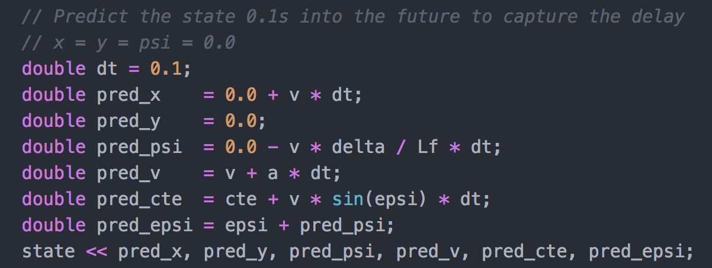

# MPC-Project

The goal of this project is to use a kinematic vehicle model to determine steering angle and throttle of a simulated vehicle.

Given a set of waypoints (here in yellow), the aim is to solve a constrained optimization problem, resulting in an optimal trajectory that steers the vehicle safely around the track (here in green). 

### Model

The kinematic model used to solve this problem is shown below.

The model predicts the vehicle position (x,y), vehicle orientation (psi), velocity (v), Cross-Track-Error (CTE) and Orientation-Error (epsi) N*dt steps into the future, thereby trying to minimize the costs of the model and taking into account additional constraints (see below).

The cost function is a combination of different elements. The first block simply adds a (weighted) squared cost for all differences in Cross-Track-Error and Orientation-Error as well as for differences between the current velocity and the reference velocity.

Additionally, the aim is to punish the change rate of of the actuations (block 2) as well as value gaps between sequential actuations to smoothen out the trajectory.

### Timestep Length and Elapsed Duration

I experimented with various N and dt values and found that a dt of 0.1 (instead of 0.05) gave me generally better results because the projection seemed to be more stable. With a step size of 0.05 seconds I found the polynomial changes more "restless". I experimented with N values between 5 and 20 and found that N=10 resulted in a good trade-off between computational effort needed to solve the optimization problem and keeping the car on the track. A N too small yielded projections too much focused on the current position not taking into account waypoints further away (especially in curvy parts of the road), whereas a N too large didn't yield any additional benefits for making decisions for the actuations or even worsened them in more curvy parts of the road.

### Polynomial fitting and MPC preprocessing

I followed the recommendation to transform the simulator (map) coordinates into the coordinate system of the vehicle, projecting x, y and psi onto 0. This is done by translating by (-px, -py) and the rotating over -psi.

(ptsx, ptsy) are the waypoints, (px, py) the vehicle (map) coordinates, psi the current vehicle orientation.

### Model predictive control with latency

In order to deal with latency I project the state one timestep into the future (0.1s) before sending it to the solver. This is done in main.cpp (lines 79-88). The update equations are the same as before. 

